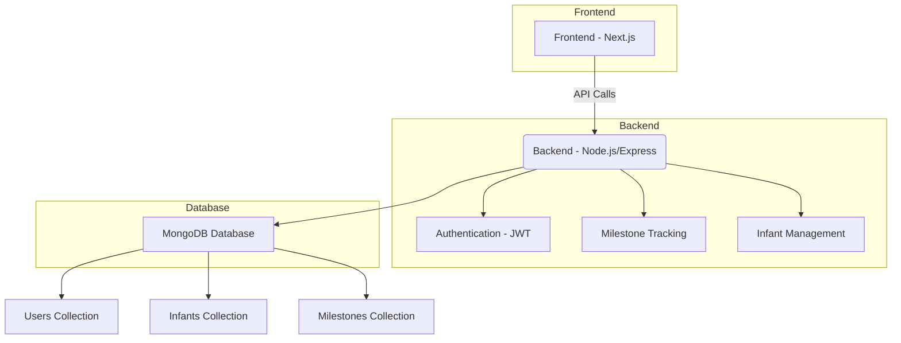
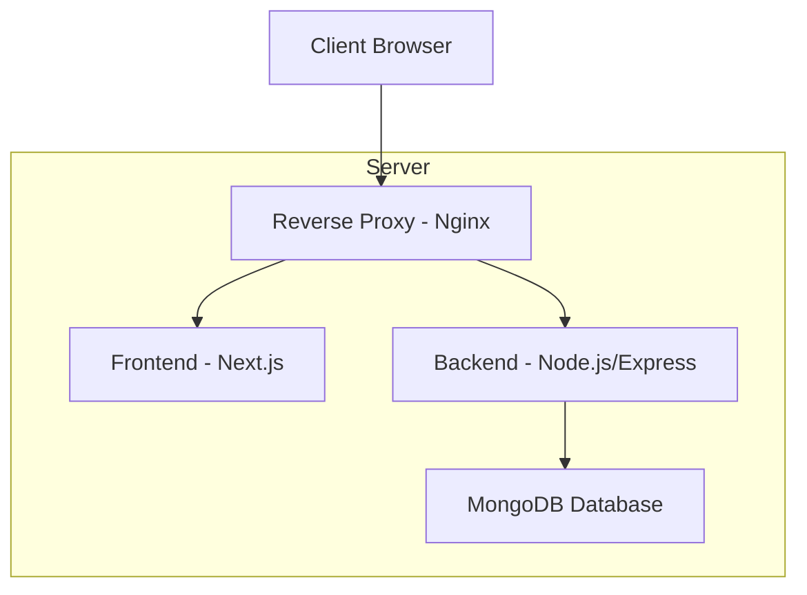

# FirstSteps Application Architecture

## System Overview



## Component Details

### Frontend (Next.js)
- **Framework**: Next.js 14 with App Router
- **Styling**: TailwindCSS
- **State Management**: Zustand
- **API Integration**: Axios with interceptors
- **Form Handling**: React Hook Form

### Backend (Node.js/Express)
- **Framework**: Express.js
- **Database**: MongoDB with Mongoose ODM
- **Authentication**: JWT with bcrypt password hashing
- **Validation**: express-validator
- **Security**: helmet, cors, rate limiting

### Database (MongoDB)
- **Users Collection**: Stores user information (parents/caregivers)
- **Infants Collection**: Stores infant profiles and milestone progress
- **Milestones Collection**: Stores developmental milestones

## Data Flow

### User Registration
1. User submits registration form
2. Frontend sends POST request to `/api/auth/register`
3. Backend validates input and creates user
4. Password is hashed with bcrypt
5. JWT token is generated and returned
6. Frontend stores token and redirects to dashboard

### User Login
1. User submits login form
2. Frontend sends POST request to `/api/auth/login`
3. Backend validates credentials
4. JWT token is generated and returned
5. Frontend stores token and redirects to dashboard

### Infant Creation
1. User submits infant form
2. Frontend sends POST request to `/api/infants`
3. Backend creates infant profile
4. All existing milestones are automatically added to infant with "Not Started" status
5. Infant data with populated milestones is returned
6. Frontend displays infant profile

### Milestone Status Update
1. User clicks milestone status button
2. Frontend sends PUT request to `/api/infants/:id/milestones/:milestoneId`
3. Backend updates milestone status
4. Updated infant data is returned
5. Frontend updates UI with new status

## API Structure

### Authentication Endpoints
```
POST /api/auth/register
POST /api/auth/login
GET /api/auth/me
PUT /api/auth/profile
POST /api/auth/change-password
```

### Milestone Endpoints
```
GET /api/milestones
GET /api/milestones/:id
POST /api/milestones/initialize
```

### Infant Endpoints
```
GET /api/infants
POST /api/infants
GET /api/infants/:id
PUT /api/infants/:id/milestones/:milestoneId
DELETE /api/infants/:id
```

## Security Implementation

### Authentication Flow
1. User provides credentials
2. Server validates credentials
3. Server generates JWT with user ID
4. JWT is signed with secret key
5. Token is sent to client
6. Client includes token in Authorization header for subsequent requests
7. Server verifies token on protected routes

### Password Security
1. Passwords are hashed with bcrypt (10 rounds)
2. Hashed passwords are stored in database
3. Original passwords are never stored

### API Security
1. Helmet.js for HTTP headers security
2. CORS configuration for cross-origin requests
3. Rate limiting to prevent abuse
4. Input validation and sanitization
5. Error messages don't expose sensitive information

## Database Schema

### User Schema
```javascript
{
  name: String,
  email: String (unique),
  password: String (hashed),
  role: String (default: "parent"),
  // ... additional fields
}
```

### Milestone Schema
```javascript
{
  name: String,
  description: String,
  category: String,
  recommendedAge: String
}
```

### Infant Schema
```javascript
{
  name: String,
  dateOfBirth: Date,
  gender: String,
  birthWeight: Number,
  birthLength: Number,
  parents: [{
    user: ObjectId (ref: 'User'),
    relationship: String,
    isPrimary: Boolean
  }],
  medicalInfo: {
    bloodType: String,
    allergies: [String],
    medications: [String],
    conditions: [String],
    pediatrician: {
      name: String,
      contact: String
    }
  },
  milestones: [{
    milestoneId: ObjectId (ref: 'Milestone'),
    status: String
  }],
  avatar: String,
  isActive: Boolean
}
```

## Virtual Fields

### Infant Virtual Fields
- `ageInMonths`: Calculated from dateOfBirth
- `ageInDays`: Calculated from dateOfBirth

## Indexes

### Infant Indexes
- `parents.user`: For efficient querying of infants by parent
- `isActive`: For filtering active infants

## Error Handling

### Common Error Responses
```javascript
{
  success: false,
  message: "Error description"
}
```

### Validation Errors
```javascript
{
  success: false,
  message: "Validation Error",
  errors: ["Error message 1", "Error message 2"]
}
```

## Environment Variables

### Required Variables
- `MONGODB_URI`: MongoDB connection string
- `JWT_SECRET`: Secret key for JWT signing
- `JWT_EXPIRE`: JWT expiration time
- `PORT`: Server port (default: 5001)
- `NODE_ENV`: Environment (development/production)
- `FRONTEND_URL`: Frontend application URL

## Deployment Architecture



This architecture allows for:
- SSL termination at the reverse proxy
- Static file serving by Nginx
- Load balancing (can be extended)
- Separation of frontend and backend services